# 🏥 Medinova | AI-Powered Healthcare Management System

Medinova, **ASP.NET MVC (.NET Framework)** kullanılarak geliştirilmiş,  
**yapay zeka destekli**, **loglanabilir**, **tahminleme yapabilen**  
kurumsal seviyede bir **Sağlık Yönetim Sistemi**dir.

Projenin amacı; yöneticilere ve admin kullanıcılara  
**randevu yoğunluğu**, **hasta şikayetleri**, **departman yönlendirmeleri** ve  
**sistem davranışlarını** tek bir panel üzerinden **anlamlı, hızlı ve görsel** şekilde sunmaktır.

---

## 🚀 Projenin Öne Çıkan Özellikleri

| Kategori | Özellik | Açıklama |
|--------|--------|---------|
| 🧠 Yapay Zeka | AI Sağlık Asistanı | Hasta şikayetine göre uygun **departman önerisi** |
| 🧠 Yapay Zeka | OpenAI Entegrasyonu | Doğal dilde şikayet analizi |
| 📊 Tahminleme | ML.NET Time Series | Gelecek **7 gün için randevu tahmini** |
| 📊 Tahminleme | SSA Algoritması | Zaman serisi tabanlı yoğunluk analizi |
| 📈 Dashboard | Chart.js Entegrasyonu | Dinamik ve etkileşimli grafikler |
| 📈 Dashboard | Haftalık Yoğunluk | Gün bazlı randevu tahmin grafikleri |
| 🐳 Altyapı | Docker Desktop | Container tabanlı sistem altyapısı |
| 🧾 Loglama | Serilog | Structured logging altyapısı |
| 🔍 Loglama | Elasticsearch | Merkezi log saklama |
| 📊 Loglama | Kibana | Log görselleştirme ve analiz |
| 🔌 Mimari | Autofac | Dependency Injection yönetimi |
| 🔐 Güvenlik | Admin Area | Yetkilendirme ve filtreleme |
| ⚙️ Performans | Optimize Veri Okuma | Günlük ve toplu veri analizleri |

---

## 🧠 Yapay Zeka Destekli Hasta Yönlendirme (OpenAI)

Sistemde, **OpenAI API** kullanılarak geliştirilmiş bir  
**AI Sağlık Asistanı** bulunmaktadır.

### Çalışma Mantığı

| Adım | Açıklama |
|---|---|
| 1 | Kullanıcı şikayetini serbest metin olarak girer |
| 2 | OpenAI modeli şikayeti analiz eder |
| 3 | En uygun **tıbbi departman** belirlenir |
| 4 | Kullanıcıya yönlendirme ve öneri sunulur |

### Örnek Çıktılar

| Hasta Şikayeti | AI Önerisi |
|--------------|-----------|
| Göğüs ağrısı ve nefes darlığı | Kardiyoloji |
| Baş dönmesi ve mide bulantısı | Dahiliye |
| Diz ve eklem ağrıları | Ortopedi |
| Ciltte kızarıklık ve kaşıntı | Dermatoloji |

> ⚠️ Yapay zeka yalnızca **yönlendirici** öneriler sunar, tıbbi tanı koymaz.
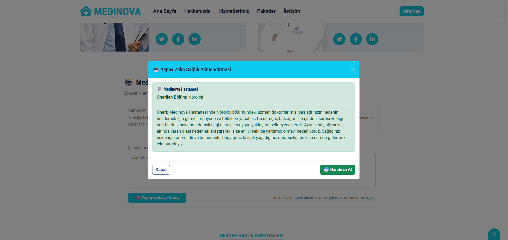
---

## 📊 ML.NET ile Randevu Tahminleme

Projede **ML.NET Time Series (SSA - Singular Spectrum Analysis)** kullanılarak  
gelecek **7 gün için randevu yoğunluğu tahmini** yapılmaktadır.

### Neden Time Series (SSA)?

| Sebep | Açıklama |
|---|---|
| Native bağımlılık yok | .NET Framework ile uyumlu |
| Zaman serisi odaklı | Günlük randevu tahmini için ideal |
| Stabil sonuçlar | Küçük/orta veri setleri için uygun |
| Sezonsallık | Haftalık yoğunluk desenlerini öğrenir |

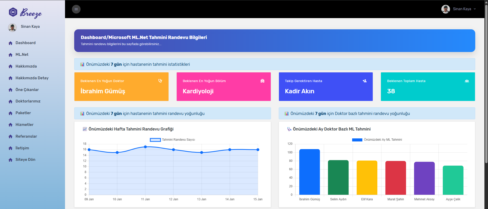

### Tahmin Süreci

| Aşama | Açıklama |
|---|---|
| Veri Hazırlama | Günlük randevu sayıları |
| Model Eğitimi | SSA algoritması |
| Forecast | 7 günlük tahmin |
| Görselleştirme | Chart.js ile grafik |

---

## 🐳 Docker & ELK Stack Entegrasyonu

Proje, **container tabanlı loglama altyapısı** ile çalışmaktadır.

Bu projede uygulama logları Docker üzerinde çalışan Elasticsearch’e gönderilmiş ve
Kibana üzerinden gerçek zamanlı olarak izlenebilir ve analiz edilebilir hale getirilmiştir.

### Kullanılan Bileşenler

| Bileşen | Amaç |
|------|-----|
| Docker Desktop | Container yönetimi |
| Elasticsearch | Logların merkezi saklanması |
| Kibana | Logların görselleştirilmesi |

Bu Dashboard Ne Gösteriyor?

⏱️ Zaman bazlı log yoğunluğu (dakika/dilim)

📌 Farklı aksiyonlara göre log dağılımı:

Kullanıcı giriş / çıkış işlemleri

Doktor & hasta randevu işlemleri

AI sağlık önerisi çağrıları

Başarısız giriş denemeleri

## 📊 Sistem üzerindeki ani yüklenmelerin ve kritik anların görsel takibi

Bu dashboard sayesinde uygulamanın hangi zaman aralıklarında yoğunlaştığı ve
hangi aksiyonların daha sık tetiklendiği net biçimde analiz edilebilir.

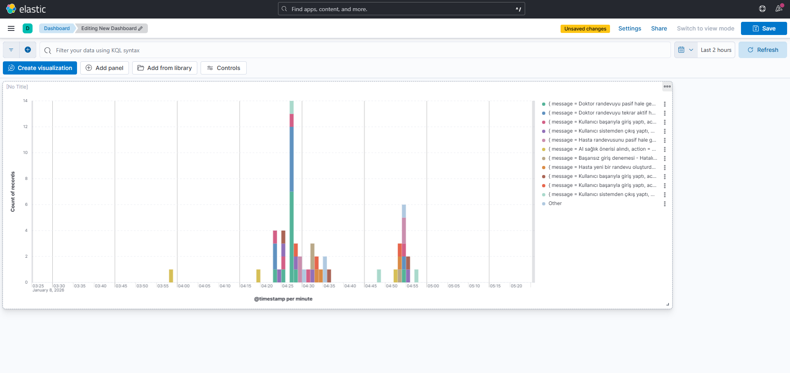

## 🔍 Kibana Discover – Detaylı Log İnceleme

Discover Ekranında Neler Var?

🧾 Tüm log kayıtları detaylı şekilde listelenir

🔍 KQL (Kibana Query Language) ile filtreleme

🧑‍⚕️ Log içeriğinde:

Kullanıcı adı

Rol (Admin / Doctor / Patient)

Controller & Action bilgisi

IP adresi

Ortam bilgisi (Production)

Log seviyesi (Information / Warning / Error)

Örnek log içeriği:
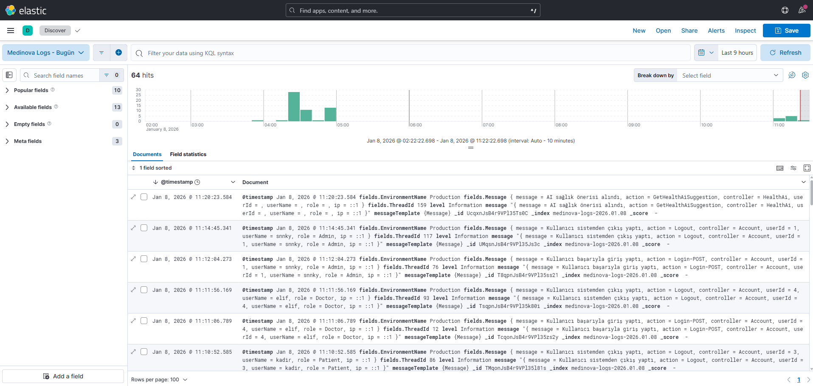

### Log Akışı

---

## 🧾 Serilog ile Loglama Altyapısı

Sistemde **Serilog** kullanılarak aşağıdaki loglar toplanmaktadır:

| Log Türü | Açıklama |
|-------|---------|
| Request Logs | HTTP istekleri |
| Error Logs | Exception ve hatalar |
| System Logs | Uygulama davranışları |
| Performance Logs | İşlem süreleri |

---

# 📤 Log Export & Excel Analizi

Bu projede Kibana üzerinden görüntülenen uygulama logları,
CSV / Excel formatında dışa aktarılabilir ve Excel üzerinde analiz edilebilir şekilde tasarlanmıştır.

Amaç; log verilerini raporlama, denetim (audit) ve operasyonel analiz süreçlerinde
uygulama dışına taşıyarak anlamlı çıktılar elde etmektir.

## 📑 Logların Excel’e Aktarılması

### Nasıl Çalışır?

- Kibana Discover ekranında istenilen loglar filtrelenir  
  (zaman aralığı, kullanıcı, rol, action vb.)
- Filtrelenen log kayıtları CSV / Excel formatında export edilir
- Export edilen dosya Excel üzerinde açılarak detaylı inceleme yapılır
- 
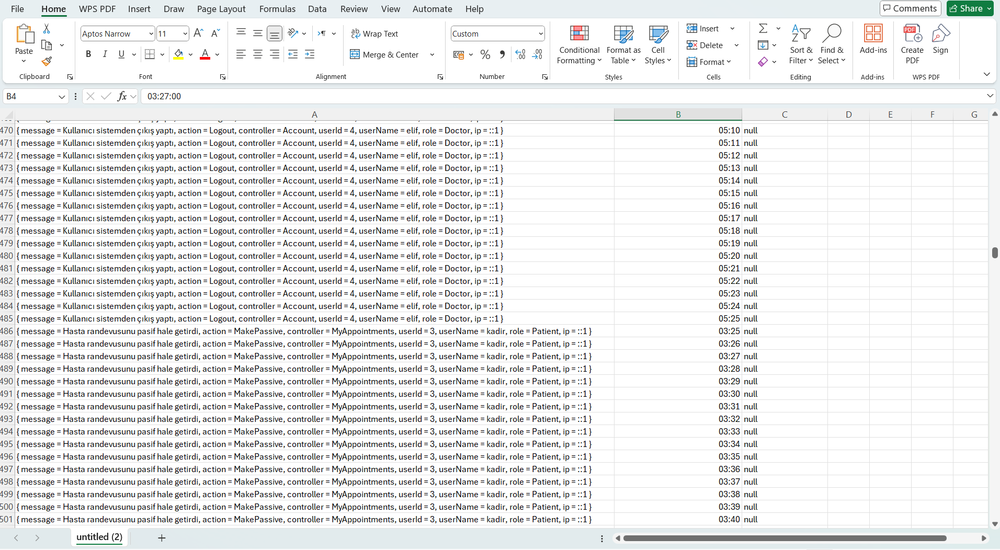

## 📊 Excel Üzerinde Yapılabilen Analizler

- Zaman bazlı işlem takibi
- Kullanıcı / rol bazlı analiz (Admin, Doctor, Patient)
- Login, Logout, Appointment, AI Request gibi aksiyonların sayımı
- Günlük / saatlik işlem yoğunluğu analizi
- Hatalı veya şüpheli işlemlerin ayıklanması

---
## 📸 Ekran Görüntüleri

### 🖼️ Ana Sayfa Banner
Kullanıcıya ilk açılışta gösterilen ana tanıtım banner alanı.

---
### 🎯 Admin Banner Yönetimi
Ana sayfa banner alanlarının dinamik olarak yönetildiği admin ekranı.
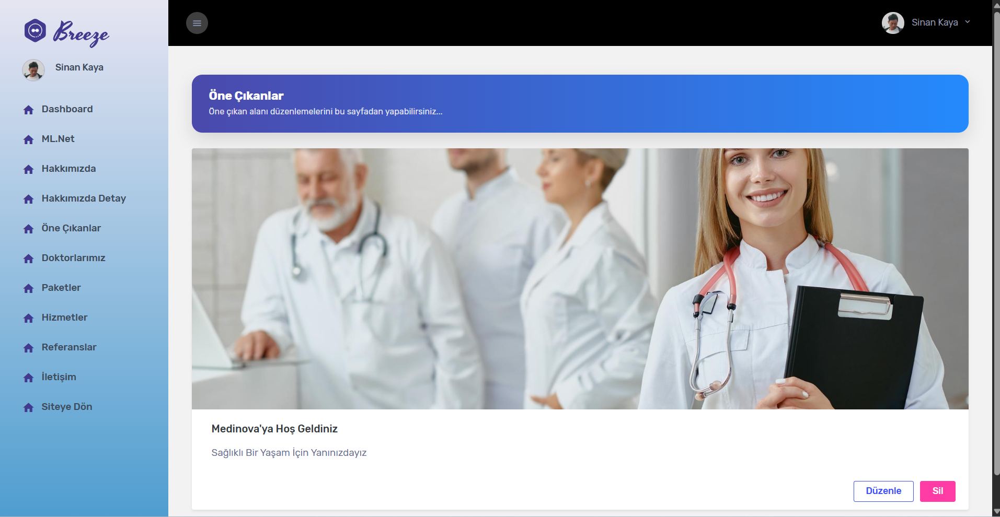

---

### 🏠 About Sayfası
Uygulamanın genel tanıtımını ve sağlık platformunun vizyonunu gösteren bilgilendirme ekranı.
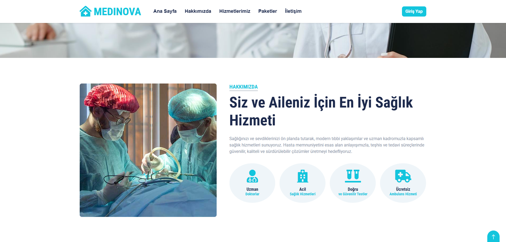

---

### 🛠️ Admin Hakkında Yönetimi
Admin paneli üzerinden About içeriklerinin yönetildiği alan.
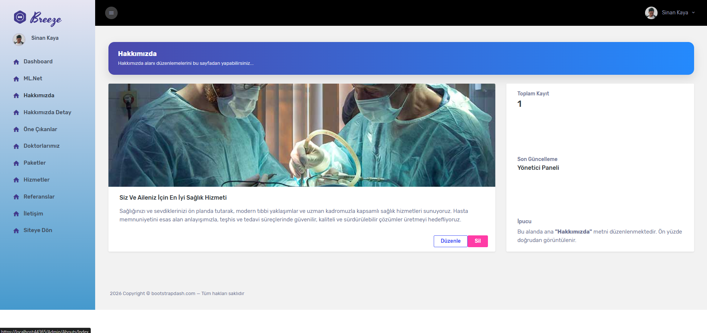

---

### 👨‍⚕️ Doktor Listeleme Sayfası
Sistemde kayıtlı doktorların kullanıcıya listelendiği ekran.
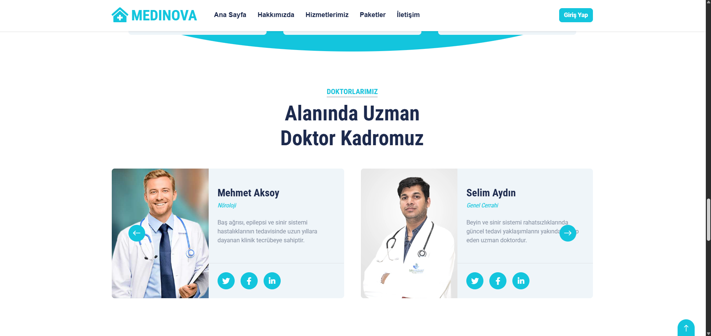

---

### 👨‍⚕️ Admin Doktor Yönetimi
Doktor bilgilerinin listelendiği ve yönetildiği admin ekranı.
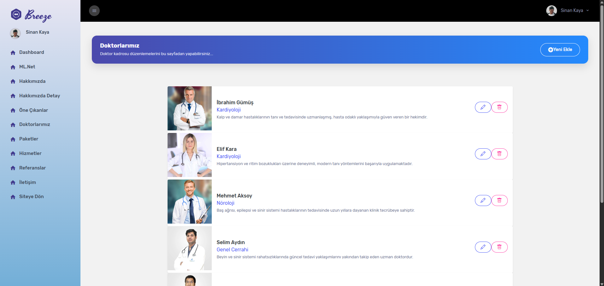

---

### 🧠 Yapay Zeka Asistanı – Ekran 1
OpenAI entegrasyonu ile kullanıcı şikayetlerinin alındığı yapay zeka sağlık asistanı.
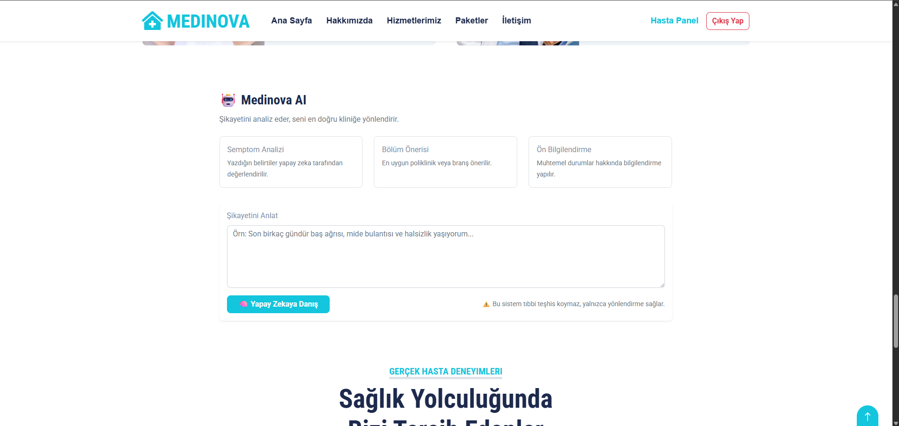

---

### 🧠 Yapay Zeka Asistanı – Ekran 2
Yapay zekanın kullanıcı şikayetini analiz ederek departman önerisi sunduğu ekran.
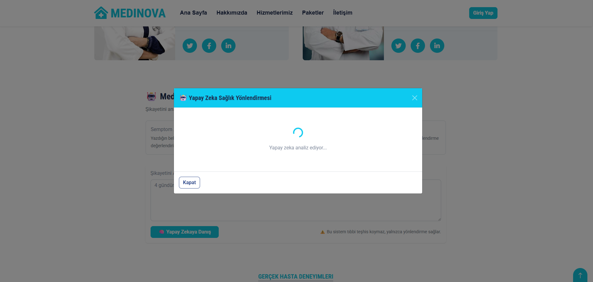

---

### 🧠 Yapay Zeka Asistanı – Ekran 3
AI tarafından üretilen sağlık önerileri ve yönlendirme çıktıları.

---

### 📞 İletişim Sayfası
Kullanıcıların sistem yöneticileri ile iletişime geçtiği sayfa.
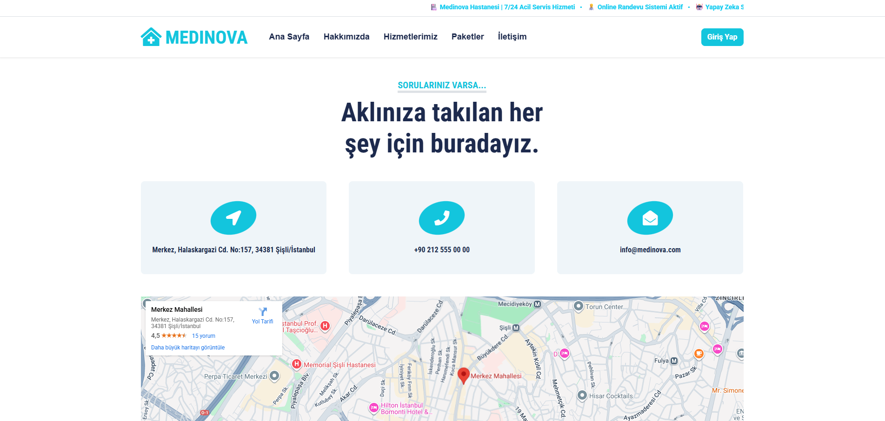

---

### 📬 Admin İletişim Yönetimi
Kullanıcılar tarafından gönderilen iletişim mesajlarının admin tarafından görüntülendiği panel.
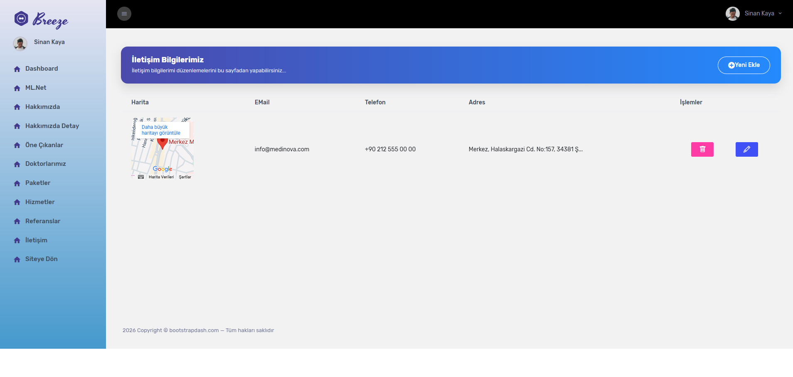

---

### 📊 Admin Dashboard Genel Görünüm
Yönetici panelinin genel istatistik ve özet bilgileri içeren ana dashboard ekranı.
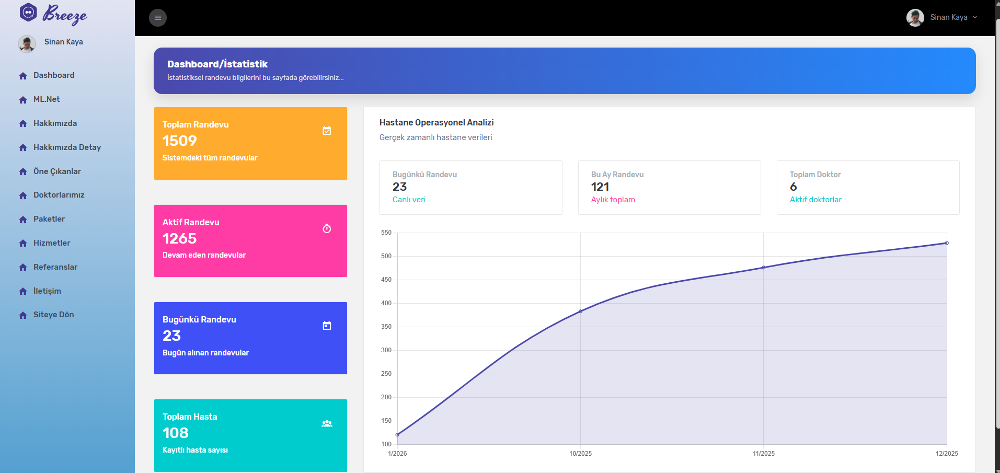

---

### 🤖 ML.NET Tahminleme Paneli (1)
ML.NET kullanılarak oluşturulan randevu yoğunluğu tahmin ekranı.

---

### 🤖 ML.NET Tahminleme Paneli (2)
Zaman serisi (SSA) algoritması ile oluşturulmuş haftalık randevu tahmin grafikleri.
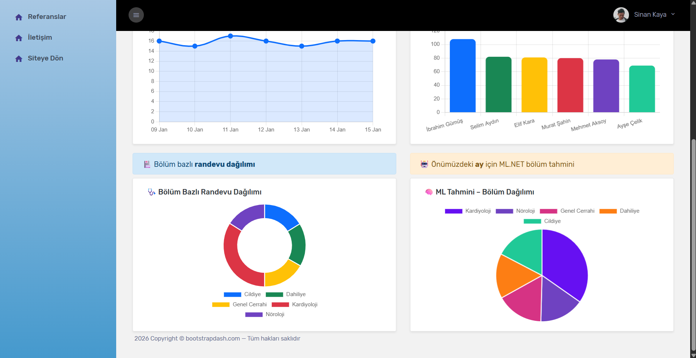

---

### 📦 Admin Paket Yönetimi
Sunulan hizmet paketlerinin admin paneli üzerinden yönetildiği ekran.
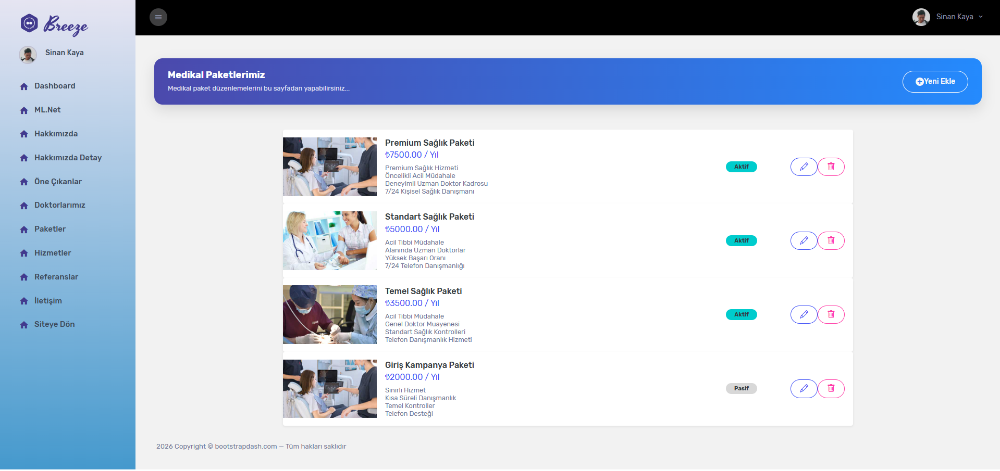

---

### 🧩 Admin Hizmet Yönetimi
Sağlık hizmetlerinin listelendiği ve düzenlendiği yönetim paneli.
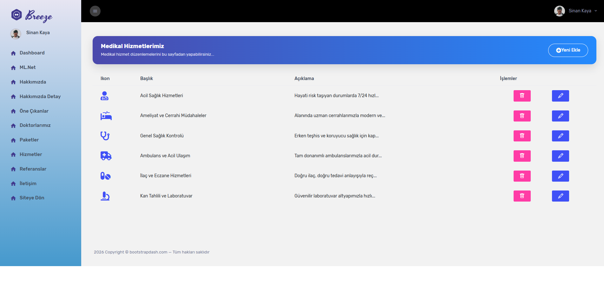

---

### 🧪 Admin Test ve Deneme Alanı
Sistem testleri ve örnek işlemler için kullanılan admin test ekranı.
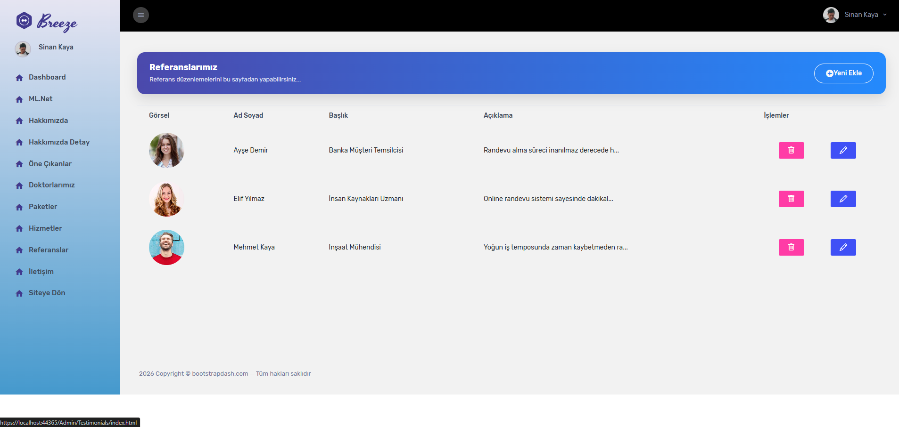

---

### 👨‍⚕️ Doktor Detay – 1
Doktorun detaylı profil bilgilerinin gösterildiği sayfa.
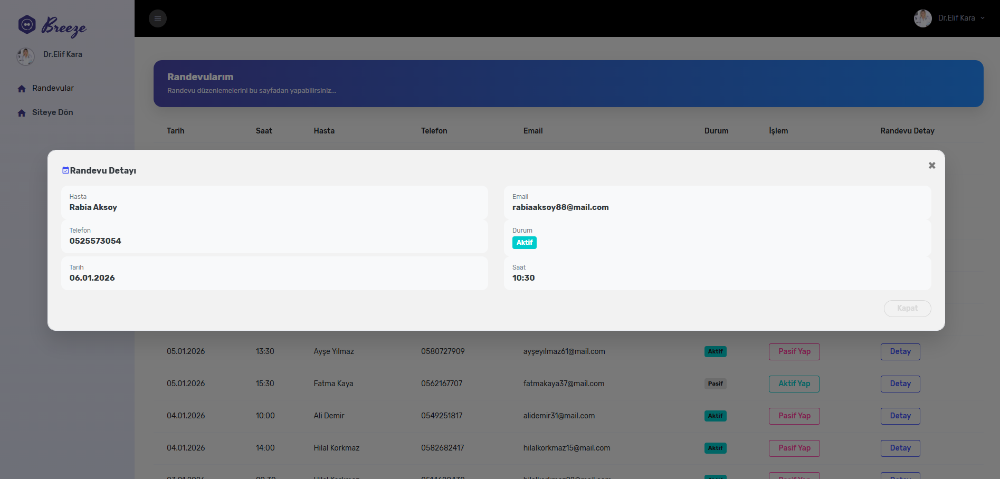

---

### 👨‍⚕️ Doktor Detay – 2
Doktorun uzmanlık ve randevu bilgilerini içeren ekran.
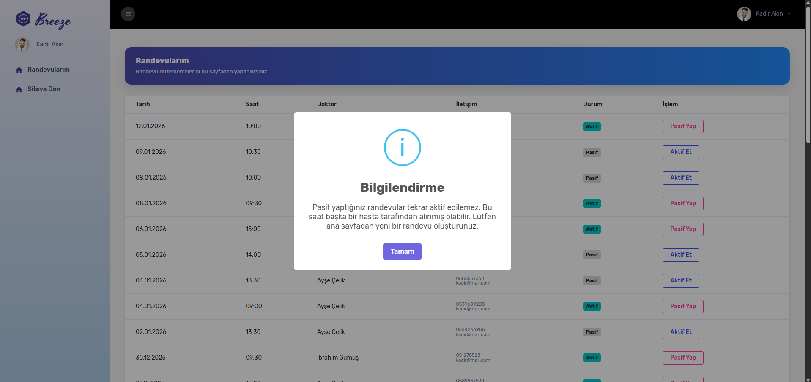

---

### 👨‍⚕️ Doktor Detay – 3
Doktorun müsaitlik durumu ve ek bilgilerini gösteren sayfa.
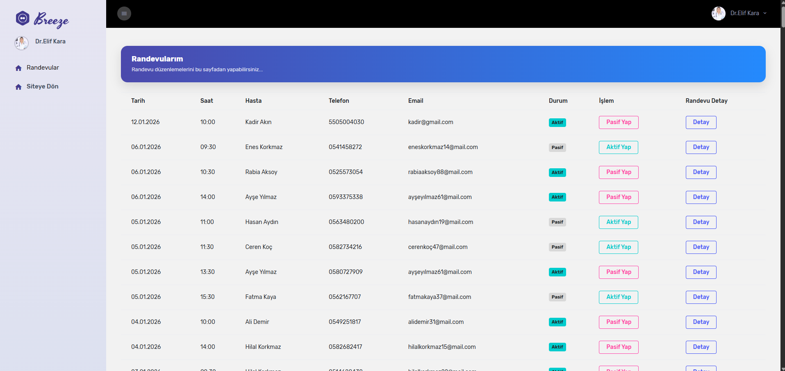

---

### ❗ Hata ve Exception Logları
Sistem içerisinde oluşan hataların loglandığı örnek ekran.

